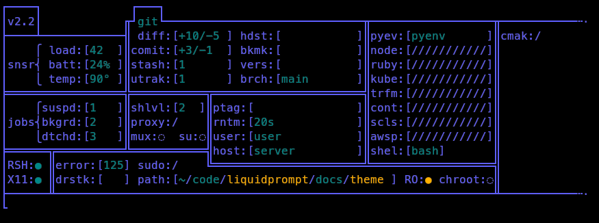

Solid — A Liquid Prompt Theme
=============================

Solid is a set of two didactic themes for [Liquid Prompt](https://github.com/nojhan/liquidprompt).

Its aim is not to actually be used as a day-to-day prompt (but you do you),
but to expose everything that Liquid Prompt actually watches.
It thus shows a table with the full state of the system, as seen by Liquid Prompt.

So far, *Solid* works for modern shells, supporting associative arrays
(that is Bash > 4.0, and Zsh > 3.1.6).
Note that Liquid Prompt does not have this requirement,
so it may work on your system, while *Solid* does not.

The two themes are `solid`, a large array of information,
and `smallid`, a dense array of tags.


Preview
-------




Solid Rationale
---------------

The `solid` theme displays (almost) all the information that Liquid Prompt can display.
All variables are always displayed at the very same location, so that you may always see their state.
That way, you can explore and understand how Liquid Prompt actually react to your system's state,
which may be especially useful if you are a theme designer.


### Explanations

Each element of the table is a label, followed by a colon and a field.
The field can be either a boolean flag ("◌"=false, "●"=true), or a fixed-size entry (between squared brackets).

Entries can show numbers (always left-aligned), texts or be filled by a "/" character.
This last state indicates that the configuration is explicitely asking for the field to not be displayed
(i.e. the `LP_ENABLE_*` variable is set to 0).

If the field is shown in the base color (violet, by default),
it would normally not be displayed in the Liquid Prompt's *default* theme;
else, it is displayed in green.
If the field content is important or indicates a potentially dangerous state,
it is displayed in yellow.


Smallid Rationale
-----------------

The `smallid` theme follows the same idea of displaying everything at the same place,
but does it mostly by coloring tags, showing less detailled information,
but in a smallest array (6 rows and 56 columns wide, which appear to be
the width of my phone's terminal under [Termux](https://termux.dev)).


### Explanations

Each element of the table is either a single letter/icon, or a small text field.
When the feature is disabled, it shows a `░` character, when it is enabled but
no information is to be displayed, the letter is in the base color.
When some information is available, the letter is colored.


Install
-------

Just download this repository somewhere, source the theme file and activate the theme from your shell configuration file.

For example (just use `~/.zshrc` instead of `~/.bashrc`, if you use Zsh and not Bash):
```sh
git clone https://github.com/nojhan/lp-neon.git
echo '# Use Liquid Prompt only if in an interactive shell
    if [[ $- == *i* ]]; then
        # Use Liquid Prompt
        source ~/.liquidprompt
        # Use the solid theme if it has been downloaded in ~.
        if [[ -f ~/lp-solid/solid.theme ]] ; then
            source ~/lp-solid/solid.theme && lp_theme solid # Or lp_theme smallid
        fi
    fi' >> ~/.bashrc
```


Configuration
-------------

TODO
